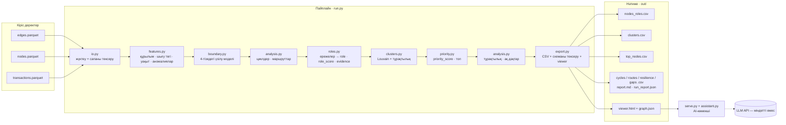

# Граф денег — транзакциялық желі бойынша ұйымдасқан топтың қаржылық құрылымын қалпына келтіру


---

> HackAlem AI · бағыт: «Талдау және шешім қабылдау / Киберқауіпсіздік және комплаенс»

## Мазмұны

1. [Қысқаша сипаттама](#1-қысқаша-сипаттама)
2. [Не іске асырылды](#2-не-іске-асырылды)
3. [Шешім қалай жұмыс істейді](#3-шешім-қалай-жұмыс-істейді)
4. [Технологиялар](#4-технологиялар)
5. [Жоба архитектурасы](#5-жоба-архитектурасы)
6. [Орнату және іске қосу](#6-орнату-және-іске-қосу)
7. [Шешімді қалай тексеруге болады](#7-шешімді-қалай-тексеруге-болады)
8. [Деректер және интеграциялар](#8-деректер-және-интеграциялар)
9. [Рөлдерді анықтау критерийлері](#9-рөлдерді-анықтау-критерийлері)
10. [Шектеулер](#10-шектеулер)
11. [Масштабтау (~1 млн түйін)](#11-масштабтау-1-млн-түйін)
12. [Deployed-нұсқа](#12-deployed-нұсқа)

---

## 1. Қысқаша сипаттама

**Мәселе.** Екінші деңгейлі банктің AML-талдаушысы құқық қорғау органдарынан есірткінің заңсыз айналымына қатысы бар клиенттердің (81 seed-клиент) тізімін алады. Бұл тізім қылмыстық тізбектің тек төменгі деңгейін қамтиды. Ақшаны кім жинайды, кім арқылы өткізеді және түпкілікті кім иеленеді — осыны талдаушы әзірге қолмен, әр түйін үшін сағаттап қалпына келтіреді. Нәтижесінде желінің басым бөлігі көрінбей қалады, ал тексеру кезегі интуициямен белгіленеді.

**Шешім.** Жоба — пайдаланушы интерфейсі бар аналитикалық пайплайн. Ол seed-клиенттердің 4 тізе тереңдікке дейінгі шығыс аударымдарының графын құрады. Әр түйінге 6 рөлдің бірін береді, рөлдің ұпайын (role_score) және басымдығын (priority_score) есептейді. Нәтижесінде талдаушы «кімді бірінші тексеру керек және неге» деген сұраққа жауап алады: әр шешімнің сандармен жазылған түсініктемесі (evidence) болады.

**Кімге арналған.** Банктің қаржы мониторингі бөлімшесінің AML-талдаушысына / маманына.

> Барлық қорытынды **тексеруге арналған гипотеза** ретінде тұжырымдалады («шоғырлану белгілері»). Бұл клиенттің кінәлі екені туралы тұжырым емес.

---

## 2. Не іске асырылды

### Міндетті функциялар (ТЗ, Must have)

| № | Функция | Қай жерде іске асырылған |
|---|---|---|
| 1 | **Қайталанатын пайплайн.** Бір команда шикі деректерден үш CSV-ге дейін апарады, қолмен орындалатын қадам жоқ | `run.py` |
| 2 | **Әр түйінге рөл, ұпай және түсініктеме.** `role`, `role_score`, `evidence` өрістері толтырылады (сандары бар, ≤200 таңба) | `gm/roles.py` |
| 3 | **Рөл критерийлері құжатталған.** Әр рөлдің формалды ережесі мен шегі бар, барлық шектер бір файлда | `gm/config.py`, [9-бөлім](#9-рөлдерді-анықтау-критерийлері) |
| 4 | **Кластерлеу.** Louvain әдісі; әр кластер бойынша өлшем, seed саны, айналым және гипотеза | `gm/clusters.py` → `clusters.csv` |
| 5 | **Басымдықтар тізімі және визуализация.** Кемінде 20 түйін (әдепкі бойынша 30); ақша ағынының бағыты, рөлдер және gid бойынша іздеу көрсетілген желі экраны | `gm/priority.py` → `top_nodes.csv`, `viewer.html` |

Пайплайн соңында шығыс файлдардың схемасы автоматты түрде тексеріледі (`gm/export.py::validate`). Жол саны, бос мәндер, сөздіктен тыс рөлдер, `[0,1]` аралығы, сұрыптау және evidence ішінде сандардың болуы қаралады. Схема бұзылса, пайплайн қатемен тоқтайды.

### Қосымша функциялар (ТЗ, опционалды)

- **4-тізедегі үзілу артефактісі (`gm/boundary.py`).** 1–3 тізедегі түйіндердің шығыстары толық көрінеді. Сондықтан солардың кіріс профилі бойынша логистикалық регрессия үйретіледі. Модель «ақша әрі қарай кетті ме, әлде қалды ма» деген ықтималдықты (`p_continue`) бағалайды; белгілер тек 4-тізеде де бар ақпараттан алынады (ағып кету жоқ). Ықтималдық калибрленеді (Platt, reliability diagram — `out/calibration.svg`), коэффициенттер 95% bootstrap-аралықтарымен есепке шығарылады, ал `p_continue < 0.35` шегі precision/recall қисығы бойынша бекітілген ережемен таңдалады ([9-бөлім](#4-тізедегі-үзілу-моделі-калибровка-және-шек)). Модельдің CV ROC-AUC мәні 0.6-дан төмен болса, жүйе болжам жасамайды: барлық үзілген түйіндерге базалық үлес беріледі және бұл есепте ашық жазылады. 4-тізедегі түйін `terminal` рөлін тек «бағаланған» (`terminal_kind=estimated`) деп және төмендетілген ұпаймен ала алады.
- **Уақыт үлгілері (`gm/features.py::temporal`).** Кіріс пен шығыс арасындағы кідіріс, 2 күн ішінде «өтпелі» жіберілген ақша үлесі (`fast_out_share`), бір күнде бірнеше төлеушіден келген синхронды аударымдар.
- **Қайталанатын маршруттар мен циклдер (`gm/analysis.py`).** A→B→C тізбектері (`routes.csv`) және ұзындығы 6-ға дейінгі қайтымды ағындар (`cycles.csv`).
- **Аномалиялар.** Шекке жақын бөлшектеу (5–10 мың теңгелік кіріс аударымдар), қайталанатын сомалар, өз тізесі ішіндегі робастық z-score.
- **Желінің тұрақтылығы (`resilience.csv`).** Топ-N түйін алынып тасталса, «seed → клиент» ақша жолдарының қанша үлесі сақталатыны есептеледі. Салыстыру төрт стратегия бойынша: біздің басымдық, PageRank, кіріс сомасы, кездейсоқ таңдау.
- **Толықтықты бағалау (`gaps.csv`).** Қай деректер жетіспейтіні және келесі кезекте қандай сұрау жасау керегі көрсетіледі (5-тізе, seed-тердің толық кірістері, 5 000 теңгеден төмен транзакциялар, банкаралық аударымдар).
- **Түйін карточкасы.** Рөл, метрикалар, priority_score қандай бөліктерден құралғаны, ірі төлеушілер мен алушылар, күндер бойынша қозғалыс, «не тексеру керек» ұсыныстары.
- **Талдаушының AI-көмекшісі (`gm/assistant.py`, `serve.py`).** Табиғи тілдегі сұрақ граф функцияларына шақыруға айналады (тораптың карточкасы, ортақ алушылар, ақша жолы, төлеушілер, топ, кластер). Жауапта gid сілтемелері болады. LLM кілті болмаса, детерминистік режим жұмыс істейді.
- **Тексеруге арналған тізім.** Экранда клиенттерді тізімге қосып, жазба қалдырып, тізімді CSV етіп жүктеп алуға болады.

---

## 3. Шешім қалай жұмыс істейді

Негізгі пайдаланушы сценарийі:

1. Талдаушы `edges.parquet`, `nodes.parquet`, `transactions.parquet` файлдарын `data/` қалтасына салады.
2. `python run.py --data data --out out` командасын іске қосады. Пайплайн:
   - деректердің сәйкестігін тексереді (транзакциялар мен қабырғалардың сомасы, жетім түйіндер, шығысы жоқ seed-тер, 4-тізедегі үзілу);
   - бағытталған салмақты граф құрып, метрикаларды есептейді;
   - рөлдерді, кластерлерді және басымдықтарды анықтайды;
   - `out/` қалтасына 3 міндетті CSV, қосымша талдаулар, есеп және `viewer.html` экранын жазады.
3. Талдаушы `out/viewer.html` файлын браузерде ашады (интернет қажет емес). Ол желі сызбасын, топ тізімді, кластерлерді, тұрақтылық талдауын және «ақ дақтарды» көреді.
4. gid бойынша іздейді. Түйін сызбада ерекшеленеді: кіріс қабырғалар — көк, шығыс қабырғалар — сарғылт. Оң жақта түйіннің карточкасы мен түсініктемесі ашылады.
5. Клиенттерді тексеруге арналған тізімге қосып, CSV түрінде жүктеп алады.
6. Қаласа, `python serve.py --out out` командасы арқылы AI-көмекшіге сұрақ қоя алады (мысалы, «кім осы бесеуден ақша жинайды?»).

---

## 4. Технологиялар

| Санат | Не қолданылған | Мақсаты |
|---|---|---|
| Тіл | Python 3 (тексерілген нұсқа — 3.11), JavaScript, HTML/CSS | пайплайн, экран |
| Деректер | pandas, numpy, pyarrow | parquet оқу, кестелермен жұмыс |
| Графтар | networkx | граф, PageRank, HITS, betweenness, Louvain, циклдер, байланысқан компоненттер |
| Есептеулер | scipy | networkx PageRank үшін қажет |
| ML | scikit-learn | 4-тізедегі үзілу моделі (LogisticRegression, StandardScaler, CalibratedClassifierCV, StratifiedKFold, bootstrap сенім аралықтары) |
| Визуализация | cytoscape.js 3.33.3 (MIT) | браузердегі интерактивті граф; файл `vendor/` ішінде жатыр, CDN қолданылмайды |
| Сервер | Python стандартты кітапханасы (`http.server`, `urllib`) | `serve.py`: экран және `/api/ask`, `/api/card` |
| AI / LLM (міндетті емес) | OpenAI-мен үйлесімді Chat Completions API немесе Anthropic Messages API, tool calling | көмекші граф функцияларын өзі таңдап шақырады |

LLM рөлдерді де, басымдықтарды да **тағайындамайды**. Олар толығымен ережелер мен метрикалар бойынша есептеледі. LLM тек есептелген фактілерді оқып, сұраққа жауапты тұжырымдайды.

---

## 5. Жоба архитектурасы



| Компонент | Файл | Не істейді |
|---|---|---|
| Жүктеу және тексеру | `gm/io.py` | parquet-ті (болмаса CSV-ді) оқиды, бағандарды тексереді, деректер сапасы туралы есеп жасайды |
| Метрикалар | `gm/features.py` | in/out дәрежелері мен айналымдары, `pass_through`, PageRank, HITS, betweenness; `seed_reach`, `merge_gain`, `n_agg_payers`, `seed_traced_in_kzt`; уақыт белгілері; аномалиялар |
| Үзілу моделі | `gm/boundary.py` | `p_continue` — 4-тізедегі түйіннің ақшасы әрі қарай кетті ме |
| Рөлдер | `gm/roles.py` | базалық рөлдер (1-өту) және `coordinator` (2-өту, итеративті), `role_score`, `evidence` |
| Кластерлер | `gm/clusters.py` | бағытсыз проекциядағы Louvain, 5 қосымша іске қосу бойынша тұрақтылық, кластер гипотезасы |
| Басымдық | `gm/priority.py` | салмақтары белгілі перцентильдер қосындысы, `why` мәтіні |
| Қосымша талдау | `gm/analysis.py` | циклдер, маршруттар, тұрақтылық, ақ дақтар |
| Экспорт | `gm/export.py` | CSV жазу, схеманы тексеру, граф орналасуы, `viewer.html` жинау |
| Экран | `gm/viewer_template.html` | интерфейс; `viewer.html` ішіне деректер мен cytoscape.js кіріктіріледі |
| Көмекші | `gm/assistant.py`, `serve.py` | граф функциялары, LLM tool calling, детерминистік режим, HTTP API |
| Шектер | `gm/config.py` | барлық шектер мен рөл салмақтары; `--config file.json` арқылы өзгертіледі |

---

## 6. Орнату және іске қосу

**Талаптар:** Python 3.10+ (тексерілгені 3.11 және 3.14, Linux және Windows 11), pip. GPU, бұлт немесе ақылы сервис қажет емес.

> **Windows.** `make` жоқ болса, Makefile ішіндегі командаларды тікелей іске қосыңыз. Виртуалды орта: `python -m venv .venv` → `.venv\Scripts\activate`. Консоль кодировкасы (cp1251/cp866) мәселе тудырмайды — скрипттер шығысты UTF-8-ке ауыстырады. Windows-та `curl` кириллицаны UTF-8 емес етіп жіберуі мүмкін; сервер ондай сұрауға түсінікті 400 қатесін қайтарады, сондықтан сұрақты браузердегі «Ассистент» қойындысынан қойған ыңғайлы.

```bash
# 1. Репозиторийді клондау
git clone <repo-url> graph-money && cd graph-money

# 2. Тәуелділіктерді орнату
python -m pip install -r requirements.txt

# 3. Деректерді data/ қалтасына салу
#    data/edges.parquet  data/nodes.parquet  data/transactions.parquet

# 4. Толық есептеу — бір команда
python run.py --data data --out out
#    немесе: make run

# 5. Экранды ашу (интернетсіз жұмыс істейді)
#    out/viewer.html файлын браузерде ашыңыз

# 6. (міндетті емес) AI-көмекшісі бар экран
python serve.py --out out          # → http://localhost:8765
```

**LLM қосу (міндетті емес).** Кілт берілмесе, көмекші детерминистік режимде жұмыс істейді.

```bash
export LLM_API_KEY=...                    # кілт
export LLM_PROVIDER=openai                # openai (OpenAI-мен үйлесімді кез келген API) | anthropic
export LLM_BASE_URL=https://api.openai.com/v1
export LLM_MODEL=<модель атауы>
python serve.py --out out
```

**Шектерді кодты өзгертпей ауыстыру:**

```bash
echo '{"cons_min_payers": 6, "dist_min_receivers": 15}' > th.json
python run.py --data data --out out --config th.json
```

**Нақты деректерсіз тексеру (синтетика):**

```bash
make demo        # tools/make_synthetic.py → data_synth/ → run.py → out_synth/
make test        # tests/test_pipeline.py — end-to-end тест; tests/test_assistant.py — AI-көмекші
```

---

## 7. Шешімді қалай тексеруге болады

### А. Нақты деректермен

```bash
python run.py --data data --out out
```

Күтілетін нәтиже:

1. Консольде «ПРОВЕРКА ДАННЫХ» блогы шығады: түйін, қабырға, транзакция және seed саны, айналым, «edges == transactions» тексерісі, 4-тізедегі шығысы жоқ түйіндер саны.
2. `схема выгрузок: OK (nodes_roles=…, clusters=…, top_nodes=…)` жолы шығады. Схема бұзылса, пайплайн `AssertionError` қатесімен тоқтап, себебін көрсетеді.
3. `out/` ішінде `nodes_roles.csv`, `clusters.csv`, `top_nodes.csv` және қосымша файлдар пайда болады.
4. Әр кезеңнің орындалу уақыты консольде және `out/run_report.json` ішінде жазылады.

### Б. Қазылардың «3 кездейсоқ gid» сценарийі

1. `out/viewer.html` файлын ашыңыз. Жоғарғы оң жақтағы өріске gid-ті (немесе оның бір бөлігін, мысалы соңғы 7–10 цифрын) енгізіп, **«Найти»** батырмасын басыңыз. Бірнеше сәйкестік болса, олардың тізімі шығады.
2. Сызба түйіннің айналасымен қайта құрылады. Кіріс аударымдар көк, шығыс аударымдар сарғылт түспен көрсетіледі.
3. Карточкада мыналар бар: рөл, `role_score`, `evidence` (сандармен), метрикалар (кімнен/кімге, сомалар, `pass_through`, `seed_reach`, `merge_gain`), priority_score-тың бөліктері және ірі контрагенттер. Осылар арқылы рөлдің неге берілгенін [9-бөлімдегі](#9-рөлдерді-анықтау-критерийлері) ережеге сүйеніп түсіндіруге болады.
4. Сол түсініктеме `nodes_roles.csv` ішіндегі `evidence` бағанында және метрика бағандарында да бар.

### В. Ұйымдастырушылардың датасетіндегі нәтиже

Пайплайн берілген датасетте (`data/`: 2 248 түйін, 3 119 қабырға, 4 840 транзакция) іске қосылды. Бастапқы `.parquet` файлдары pyarrow арқылы тікелей оқылады; нәтиже CSV-жол арқылы алынған нәтижемен сан жағынан толық сәйкес келеді (қайталанатындығы тексерілді). Нәтижелер `out/report.md` және `out/run_report.json` файлдарында сақталған.

**Деректер сапасы.** Тексеру ТЗ-дағы сандардың бәрін растады: 81 seed; тізелер бойынша 81 / 472 / 462 / 789 / 444; айналым 365 890 012 KZT; 19 seed қабырғаларда жоқ; 12 seed тек алушы ретінде кездеседі; 31 seed-тің шығысы жоқ; 4-тізедегі 444 түйіннің шығысы жоқ; `edges` пен `transactions` жұптар, сомалар және аударымдар саны бойынша толық сәйкес келеді.

**Рөлдер:** `peripheral` — 1 715, `terminal` — 409 (оның 368-і бақыланған, 21-і ішінара, 20-сы бағаланған), `distributor` — 56, `transit` — 34, `consolidator` — 30, `coordinator` — 4.

**4-тізедегі үзілу моделі:** 1–3 тізедегі 1 723 түйінде үйретілді (тек таяз тізелерден келген аударымдар — ағып кету жоқ), CV ROC-AUC = 0.659, 1–2 → 3 тізеге тасымалдау AUC = 0.660. Калибровка — Platt, ECE 0.048. Модель бойынша үзілген 444 түйіннің шамамен 245-і нақты «сток» болуы ықтимал; `p_continue < 0.35` шегі бойынша 20-сы `terminal (estimated)` алды (толығырақ — [9-бөлім](#9-рөлдерді-анықтау-критерийлері)).

**Кластерлер:** 45 кластер, оның 10-ында бірден көп seed бар. Табылған циклдер (қайтымды ағындар, ұзындығы ≤ 6) — 1 541.

**Тұрақтылық** — топ-N түйін алынғаннан кейін сақталған «seed → клиент» ақша жолдарының үлесі (аз болса — желі қаттырақ үзіледі):

| Алынған түйін саны | Біздің басымдық | PageRank | Кіріс сомасы | Кездейсоқ | Betweenness | Алушылар саны (out_deg) |
|---|---|---|---|---|---|---|
| 10 | 72% | 99% | 99% | 99% | 49% | 69% |
| 20 | 70% | 96% | 98% | 98% | 29% | 25% |
| 50 | **52%** | 94% | 86% | 94% | 18% | 14% |

Адал салыстыру: басымдық бойынша топ-50 ақша жолдарының 48%-ын үзеді — PageRank, сома және кездейсоқ таңдаудан (6–14%) көп.
Бірақ таза құрылымдық метрикалар (betweenness, out_deg) көбірек үзеді (82–86%): олар графты «кесуге» оңтайлы, бірақ seed-тен
келген ақшаны да, түсіндірмені де ескермейді. Басымдық басқа сұраққа жауап береді — **кімді бірінші тексеру керек**, сондықтан
салмақтар бұл метрикаға бейімделмеген (метрика seed-белгілерімен ішінара қиылысады — бейімдеу тұйық шеңбер болар еді).

**Толық есептеу уақыты:** ~6–9 секунд (әзірлеу ортасында, `viewer.html` және 5 досьемен қоса).

> Рөлдер мен басымдықтар — тексеруге арналған гипотезалар. Ground truth жоқ, сондықтан бұл сандар «дәлдікті» емес, критерийлер қалай жұмыс істейтінін көрсетеді.

### Г. Нақты деректерсіз (синтетика бойынша)

```bash
python tests/test_pipeline.py      # соңында "OK" шығуы керек
```

Тест синтетикалық деректер генерациялайды (`tools/make_synthetic.py`) және пайплайнды толық іске қосады. Содан кейін келесілерді тексереді:

- `nodes_roles.csv` ішіндегі gid жиыны `nodes` жиынымен сәйкес келеді, міндетті бағандарда бос мән жоқ;
- әр `cluster_id` үшін `clusters.csv` ішінде жол бар;
- `top_nodes.csv` кемінде 20 жол және кему ретімен сұрыпталған;
- 4-тізедегі үзілген түйін «бақыланған» `terminal` бола алмайды;
- seed-ке `transit` рөлі берілмейді;
- синтетикаға алдын ала салынған консолидаторлардың кемінде 80%-ы `consolidator`, `coordinator` немесе `transit` ретінде табылады;
- `run_report.json` ішінде `calibration`, `feature_importance_ci`, `threshold_curve` өрістері бар;
- **сапа шегі:** CV AUC < 0.6 болса, модель болжам жасамауы тиіс (барлық үзілген түйінге базалық үлес, ал базалық үлес шектен
  жоғары болса — бірде-бір `terminal (estimated)` жоқ). Синтетикада бұл тапсырмаға сигнал жоқ (AUC ≈ 0.53), сондықтан тест
  дәл осы деградацияны тексереді;
- жеке тесттер: сигнал бар ойыншық деректерде модель үйренеді (AUC ≥ 0.8, ECE < 0.1, дұрыс белгі статистикалық мәнді),
  ал кездейсоқ белгілерде базалық үлеске түседі.

Синтетика бойынша бір іске қосудың нәтижесі (2 060 түйін, 2 466 қабырға; `out_synth/report.md`):

- толық есептеу уақыты шамамен 4 секунд;
- 41 кластер, оның 10-ында бірден көп seed бар;
- тұрақтылық: басымдық бойынша топ-10 түйін алынса, «seed → клиент» ақша жолдарының 76%-ы сақталады (кездейсоқ 10 түйін алынса — 94%); топ-50 алынса — 51% (кездейсоқ — 86%).

> Бұл сандар **синтетикалық** деректерге ғана қатысты. Нақты датасеттегі сандар басқаша болады.

### Д. AI-көмекшіні тексеру

```bash
python serve.py --out out
curl -s localhost:8765/api/health
curl -s -X POST localhost:8765/api/ask -H 'Content-Type: application/json' \
     -d '{"question":"Кто собирает деньги с <gid1>, <gid2>, <gid3>?"}'
curl -s "localhost:8765/api/card?gid=<gid>"
```

Жауапта `mode` (LLM немесе детерминистік режим) және шақырылған граф функцияларының тізімі (`tools`) көрсетіледі.

Экрандағы «Ассистент» қойындысында **«кто собирает деньги с этих seed?»** мысал-батырмасы топ-1 түйінге ≤3 аударыммен ақшасы жететін seed-терді өзі таңдайды, сондықтан нақты датасетте жауап бос болмайды: мысалы, 3 seed-тің ақшасы 3-еуінен де `100000008165763100` координаторына (приоритет 0.781) жиналатыны көрінеді.

**API кілтінсіз LLM циклін тексеру:**

```bash
python tests/test_assistant.py     # соңында "OK" шығуы керек
```

Тест жергілікті жалған LLM-серверді көтереді. «Модель» бірінші қадамда граф функциясын және әдейі қате функцияны шақырады, екінші қадамда нәтижелерден жауап құрастырады. Тексерілетіні: Anthropic және OpenAI протоколдары, tools схемасы, қате аргументтердің модельге `error` ретінде қайтарылуы (жауап құламайды), LLM қолжетімсіз болғанда детерминистік режимге ауысу және сұрақ ниетін анықтау (кім жинайды / қайдан / жол).

---

## 8. Деректер және интеграциялар

| Көз | Сипаттамасы |
|---|---|
| `data/edges.parquet` | `src, dst, sum_kzt, n_tx, depth` — кезең бойынша жинақталған «төлеуші → алушы» жұбы |
| `data/nodes.parquet` | `gid, depth, is_seed` — бірегей клиент |
| `data/transactions.parquet` | `src, dst, date, sum_kzt` — жеке транзакция |
| `tools/make_synthetic.py` | нақты деректер болмаған кездегі тестке арналған синтетикалық генератор (сол схема, 4 тізелік айналып өту, 5 000 теңге шегі) |
| LLM API (міндетті емес) | OpenAI-мен үйлесімді `/chat/completions` немесе Anthropic `/v1/messages`; тек `LLM_API_KEY` берілгенде ғана шақырылады |

Сыртқы деректер көздері, байыту немесе клиенттердің жеке деректері (аты-жөні, ЖСН, жасы) **қолданылмайды**. Шешім тек құрылымға, сомаларға және күндерге сүйенеді. Интерфейс сыртқы CDN-дерден ештеңе жүктемейді.

`io.py` ішінде қосалқы жол бар: `.parquet` табылмаса, сол атаулы `.csv` оқылады. Ол синтетика үшін және pyarrow орнатылмаған машиналар үшін қосылған.

---

## 9. Рөлдерді анықтау критерийлері

Барлық шектер `gm/config.py` ішінде жинақталған. Ережелер бекітілген ретпен тексеріледі және бірінші сәйкес келгені қолданылады. `coordinator` рөлі — екінші өту: ол базалық рөлдер анықталғаннан кейін, тұрақтанғанша қайталап тексеріледі.

| Рөл | Ереже (әдепкі шектер) | role_score |
|---|---|---|
| `consolidator` | `in_deg ≥ 5` әр түрлі төлеуші **және** `in_kzt ≥ P75` (кіріс алушылар арасында) **және** хаб емес (алғанының 150%-ынан артығын 10+ алушыға таратпайды) | төлеушілер саны, кіріс перцентилі, seed-төлеушілер |
| `distributor` | `out_deg ≥ 10` алушы **және** `out_deg / max(in_deg,1) ≥ 3` | алушылар саны, «желпуіш» коэффициенті, шығыс перцентилі |
| `transit` | seed емес; `0.8 ≤ out/in ≤ 1.2`; `in_deg ≤ 4`, `out_deg ≤ 4`; `in_kzt ≥ 50 000` | 1-ден ауытқу, 2 күн ішінде өткен үлес, айналым |
| `terminal` | бақыланған: `out_deg = 0` және `depth < 4`; ішінара: `depth < 4`, әрі қарай ≤ 20% кетті, ≥ 500 000 KZT қалды; бағаланған: 4-тізе және калибрленген `p_continue < 0.35` ([шектің негіздемесі](#4-тізедегі-үзілу-моделі-калибровка-және-шек)); бәрінде `in_kzt ≥ 100 000` немесе `in_deg ≥ 2` | бақыланған: 0.6 + 0.4·перцентиль; ішінара: 0.5 + …; бағаланған: 0.6·(1−p) |
| `coordinator` | хронология бойынша `seed_reach ≥ 3`, `in_kzt ≥ P90`, түйін «науа» емес, және мына шарттардың кем дегенде біреуі: ≥2 төлеушісі consolidator/coordinator; distributor-ды қаржыландырады; ≥2 агрегат-тармақты біріктіріп, `merge_gain ≥ 2`. «Бір мезгілде жинайды әрі таратады» жалғыз өзі жеткіліксіз — P2P-айырбастаушылар да солай көрінеді | seed_reach, кіріс перцентилі, орындалған критерийлер саны |
| `peripheral` | қалған түйіндер | рөл белгілерінің **жоқтығына** сенімділік; 4-тізеде ×0.6 |

**Негізгі метрикалар:**

- `seed_reach` — түйінге **хронология бойынша** жететін әр түрлі seed-тер саны: тізбектің әр келесі аударымы алдыңғысынан ерте емес (күн бірдей болуы мүмкін). A→B 20-шілдеде және B→C 5-шілдеде — бір ақшаның қозғалысы емес. Датасыз статикалық жол саны анықтама ретінде `seed_reach_static` бағанында сақталады (топ-1 үшін 9-дың орнына 2 seed).
- `merge_gain` — түйін ең «бай» кіріс тармағынан артық қанша seed-ағынды біріктіреді; тармақ u→v тек u-ға аударымға дейін жеткен seed-терді ғана «тасиды». Дистрибьютордың дропы үшін бұл 0, консолидатор үшін — оның seed-тері саны.
- `n_agg_payers` — өздері ≥2 seed-тің ақшасын тасымалдайтын төлеушілер саны («екінші деңгейдегі шоғырлану»).
- `seed_traced_in_kzt` — пропорционалды трассировка: кіріс ақшаның қаншасы seed-тізбегіне дейін қадағаланады. Түйін алғанынан көп жіберсе, артық бөлігі сырттан келген деп саналады.

**Seed-тердің ерекшелігі.** Seed-тердің кірісі азайтылып көрсетілген, өйткені граф солардан бастап құрылған. Сондықтан оларға `transit` берілмейді, evidence ішінде «(seed: входящие занижены)» деген белгі қойылады, ал priority_score 0.85-ке көбейтіледі (фокус жаңа түйіндерге ауысуы үшін).

**priority_score ∈ [0,1]:**

```
0.25 × рөл салмағы × role_score        (coordinator 1.0 · consolidator 0.9 · distributor 0.8 ·
                                          transit 0.6 · terminal 0.55 · peripheral 0.1)
0.20 × pct(seed_traced_in_kzt)
0.15 × pct(merge_gain)
0.15 × pct(seed_reach)
0.10 × pct(pagerank)
0.10 × pct(betweenness)
0.05 × жалаушалар (өтпелі өткізу, бөлшектеу, синхрондық, цикл, аномалия)
× 0.85 егер seed болса
```

`pct` — тек оң мәндер арасындағы перцентиль (нөлдер 0 болып қалады). Әр құраушы `nodes_roles.csv` ішінде `prio_*` бағандарында және түйін карточкасында көрсетіледі.

**Кластерлер.** Louvain бағытсыз проекцияда іске қосылады (әдіс бағытты ескермейді, бұл әдейі атап өтілген). Қабырға салмағы — `log1p(сома u→v + v→u)`. Тұрақтылық — басқа 5 random seed-пен алынған кластерлермен ең жақсы Жаккар коэффициентінің орташасы. Қабырғасы жоқ түйіндер `cluster_id = 0` («желіден тыс») болады. Гипотеза кластердегі рөлдердің құрамы бойынша ережемен құрастырылады.

### 4-тізедегі үзілу моделі: калибровка және шек

**Не бағаланады.** 4-тізедегі түйіннің шығыстары жүктелмеген. Модель (`gm/boundary.py`) 1–3 тізедегі түйіндерде үйренеді
(олардың шығыстары толық көрінеді) және `p_continue = P(ақша әрі қарай кетті)` береді. Белгілер тек 4-тізеде де бар
ақпараттан құралады: таяз тізелерден келген аударымдар және төлеушілердің профилі (ағып кету жоқ).

**Калибровка.** `p_continue` шекпен салыстырылатындықтан, «0.35» шынымен ≈ 35% дегенді білдіруі керек. Бұл out-of-fold
болжамдар бойынша тексеріледі (5-fold стратификацияланған CV, `random_state=0`): reliability diagram — `out/report.md` және
`out/calibration.svg`, сандар — `run_report.json → boundary_model.calibration`.

| | Brier | ECE |
|---|---|---|
| калибровкасыз логистикалық регрессия | 0.2166 | 0.048 |
| Platt (sigmoid) — **таңдалды** | 0.2166 | 0.048 |
| isotonic | 0.2153 | — |

Ереже: isotonic тек Brier-ді ≥ 1%-ға жақсартса ғана таңдалады (1.7 мың мысалда ол «баспалдақтармен» оңай қайта үйренеді);
мұнда жақсару 0.6% — Platt қалды. Қорытынды: логистикалық регрессия өзі-ақ жақсы калибрленген, калибратор тек кепілдік.

**Коэффициенттер** (стандартталған белгілер, bootstrap n=200, 95% сенім аралығы — `feature_importance_ci`):
статистикалық мәнді тек екеуі — орташа кіріс чек (−0.56, [−1.07; −0.06]: ірі бірлі-жарым аударымдар ақшаның «отыратынын»
білдіреді) және төлеушілердің орташа алушылар саны (−0.46, [−0.58; −0.33]: «желпуіштен» алғандар әрі қарай сирек жібереді).
Қалғандарының аралығы нөлді қамтиды — олар үшін бағыт туралы қорытынды жасамаймыз.

**Шекті таңдау (`terminal_max_p_continue = 0.35`).** «Сток» дегеніміз — `p_continue < шек`. Precision / recall 1–3 тізедегі
out-of-fold болжамдар бойынша есептеледі (онда шындық белгілі), ал 4-тізеде қанша түйін таңдалатыны — нақты болжаммен.
1–3 тізедегі стоктардың базалық үлесі — **0.626** (кез келген түйінді «сток» деп белгілесек, precision осындай болады).

| шек | precision (CV) | recall (CV) | 4-тізеде таңдалады | не болады |
|---|---|---|---|---|
| 0.25 | 0.841 | 0.270 | **0** | дәл, бірақ 4-тізеде бір түйін де таңдалмайды — ереже жұмыс істемейді |
| 0.30 | 0.745 | 0.355 | 1 | іс жүзінде сол нәтиже |
| **0.35** | **0.742** | **0.466** | 35 | precision базадан +0.12 жоғары, recall 0.30-мен салыстырғанда +31% |
| 0.40 | 0.715 | 0.666 | 151 | precision талаптан төмен (0.726) |
| 0.45 | 0.683 | 0.828 | 284 | 444-тің 284-і «сток» — базалық деңгейге жақын (+0.06), белгілеу мағынасын жоғалтады |

Ереже кодта бекітілген (`boundary.recommend_threshold`): **precision ≥ базалық үлес + 0.10 болатын ең үлкен шек** (яғни
recall-ды барынша арттырамыз, бірақ «барлығын белгілеу» деңгейінен кемінде 10 п.п. жоғары дәлдікті сақтаймыз). Нақты
деректерде ол өз бетінше 0.35-ті таңдайды; `run_report.json → boundary_model.terminal_threshold.agrees = true`. Басқа
деректерде ереже басқа шекті ұсынса, отчётта «НЕ совпадает» деп көрсетіледі — `--config` арқылы өзгертуге болады.
35 таңдалған түйіннің 20-сы `terminal (estimated)` алады, қалғандары `in_kzt ≥ 100 000 немесе in_deg ≥ 2` сүзгісінен өтпейді.

**Деградация (тестпен бекітілген).** CV AUC < **0.6** болса, модель болжам жасамайды: барлық үзілген түйінге 1–3 тізедегі
базалық үлес (≈ 0.37) беріледі. Ол 0.35-тен жоғары, сондықтан бірде-бір `terminal (estimated)` тағайындалмайды — жүйе
«білмеймін» дейді. Синтетикада (AUC ≈ 0.53) дәл осы жағдай болады, `tests/test_pipeline.py` оны тексереді.

---

## 10. Шектеулер

- **Шектер эвристикалық.** Олар ТЗ-дағы бағдарлар мен деректердің таралуы бойынша қойылған; басқа деректер үшін `--config` арқылы баптау қажет болуы мүмкін.
- **LLM режимі нақты API кілтімен тексерілмеген.** Агенттік цикл (tools сериализациясы → функцияларды орындау → `tool_result` қайтару → жауап) екі протокол бойынша да (Anthropic Messages, OpenAI Chat Completions) жергілікті жалған LLM-сервермен тексерілген: `tests/test_assistant.py`. Нақты модельдің жауап сапасы кілтке байланысты; қате болса, көмекші автоматты түрде детерминистік режимге ауысады.
- **Ground truth жоқ.** Рөлдердің дұрыстығы accuracy арқылы емес, критерийлердің негізділігі арқылы бағаланады. Синтетикадағы салынған рөлдермен салыстыру — тек өзін-өзі тексеру.
- **Үзілу моделінің сапасы орташа.** Нақты деректерде CV ROC-AUC = 0.659 (1–2 → 3 тізеге тасымалдау 0.660), синтетикада ≈ 0.53 (бұл жағдайда жүйе болжам жасамай, базалық үлесті қолданады — тестпен тексеріледі). 1–3 тізеде «ақша кетті ме» деген шындық белгілі, бірақ 4-тізенің таралуы басқаша болуы мүмкін (модель онда p-ны жоғарырақ береді), сондықтан `terminal (estimated)` — тек бағалау. Шек 0.35 1–3 тізедегі precision/recall бойынша таңдалған (9-бөлім), 4-тізедегі нақты дәлдік тексерілмеген — 5-тізе жүктелгенде тексеруге болады.
- **Циклдер саны көп (1 541).** Ұзындығы 6-ға дейінгі барлық қарапайым циклдер саналады, көбі бір-бірімен қиылысады; экранда тек ірілері (топ-15) көрсетіледі.
- **Деректердің өзінен туындайтын шектеулер:** тек шығыс аударымдар және тек банк ішіндегі аударымдар бар; 5 000 теңгеден төмен транзакциялар көрінбейді; seed-тердің кірістері азайтылып көрсетілген; клиент атрибуттары жоқ. Бұл шектеулер `gaps.csv` ішінде ұсынылған сұраулар түрінде көрсетіледі.
- **Экран.** Толық желі режимі бірнеше мың түйінге арналған. Түйін саны ондаған мыңнан асса, көрсетуді шектеу қажет (эго-желі, кластер немесе топ режимдері).
- «Кімді бірінші тексеру» тізімі (`localStorage`) тек сол браузерде сақталады, серверде сақталмайды.

---

## 11. Масштабтау (~1 млн түйін)

Бұл бөлім — жоспар ғана, іске асырылған жоқ (ТЗ бойынша талап етілетін мәтін).

- **Деректер:** pandas орнына DuckDB/polars; жинақтаулар SQL арқылы.
- **Граф:** networkx орнына igraph / graph-tool; Louvain орнына Leiden.
- **seed_reach:** 81 BFS орнына scipy.sparse арқылы сирек матрицалармен жиындарды тарату (seed битмаскалары).
- **betweenness:** түйіндер іріктемесі бойынша жуықтап есептеу (`k`-sample).
- **Тұрақтылық:** тек топ-N үшін, инкременттік қайта есептеумен.
- **Экран:** толық граф көрсетілмейді; эго-желілер мен кластерлер сұрау бойынша серверден беріледі, орналасу алдын ала есептеледі.

---

## 12. Deployed-нұсқа

Deployed-нұсқа **жоқ**. Шешім ТЗ талабына сай толығымен жергілікті машинада жұмыс істейді. Экранды ашу үшін `run.py` жасаған `out/viewer.html` файлын браузерде ашу жеткілікті.

---

### Репозиторий құрылымы

```
graph-money/
├── run.py                 # бір командамен толық есептеу
├── serve.py               # экран + AI-көмекші (http://localhost:8765)
├── gm/
│   ├── config.py          # барлық шектер мен салмақтар
│   ├── io.py              # жүктеу және деректер сапасын тексеру
│   ├── features.py        # метрикалар
│   ├── boundary.py        # 4-тізедегі үзілу моделі
│   ├── roles.py           # рөл ережелері, role_score, evidence
│   ├── clusters.py        # Louvain, тұрақтылық, гипотезалар
│   ├── priority.py        # priority_score, топ-лист
│   ├── analysis.py        # циклдер, маршруттар, тұрақтылық, ақ дақтар
│   ├── export.py          # CSV, схеманы тексеру, viewer
│   ├── assistant.py       # AI-көмекші
│   └── viewer_template.html
├── vendor/cytoscape.min.js  (+ LICENSE, MIT)
├── tools/make_synthetic.py  # синтетикалық деректер
├── tests/test_pipeline.py   # end-to-end тест
├── requirements.txt
└── Makefile
```
