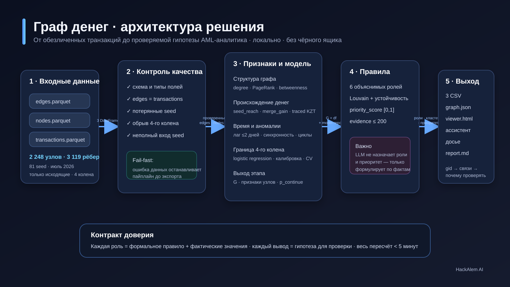

# Архитектура graph-money

Статус документа: **архитектурная разведка и план; поведенческий рефакторинг не начат**.

Документ описывает фактическое устройство проекта на 23.09.2026 и целевую архитектуру,
к которой можно переходить только маленькими зелёными шагами. Публичные контракты ниже —
инварианты: рефакторинг не имеет права менять CLI, HTTP API, схему или значения артефактов.



## 1. Архитектурные ограничения

1. Обязательные результаты — `nodes_roles.csv`, `clusters.csv`, `top_nodes.csv`; порядок,
   имена колонок и значения сохраняются побайтно.
2. `graph.json`, `viewer.html`, `out/cases/*.md`, `/api/ask`, `/api/card`,
   `/api/investigate`, `/api/health` сохраняют формат и семантику.
3. CLI остаётся совместимым:
   - `python run.py --data data --out out [--config th.json] [--no-viewer] [--cases N]`;
   - `python serve.py --out out [--port PORT]`;
   - `python investigate.py --gid GID | --seeds GID ... [--no-llm]`.
4. Зависимости не расширяются: pandas, NumPy, NetworkX, SciPy, scikit-learn, PyArrow;
   HTTP-сервер — стандартная библиотека. Всё работает локально на Python 3.11+ в Windows и Linux.
5. GID — непрозрачный идентификатор. В pandas он хранится как `int64`, в `graph.json` и
   JavaScript — как строка, чтобы не потерять точность выше `2^53`.
6. Роль, приоритет и факты рассчитываются детерминированно. LLM может только выбрать
   разрешённый запрос к графу и сформулировать текст по уже рассчитанным фактам.
7. До первого переноса кода нужен golden-набор. Любое расхождение хэша — остановка шага,
   расследование и отдельное согласование, а не автоматическое обновление эталона.

## 2. Фактическая архитектура

### 2.1. Поток данных

```mermaid
flowchart LR
  P[edges/nodes/transactions<br/>Parquet или CSV] --> IO[gm.io<br/>load + sanity_check]
  IO -->|edges, nodes, tx| F[gm.features<br/>DiGraph + structural + provenance<br/>temporal + anomalies]
  F -->|G, node DataFrame, tx| B[gm.boundary<br/>p_continue + model report]
  B --> A[gm.analysis<br/>cycles + routes]
  A --> R[gm.roles<br/>role + role_score + evidence + pattern]
  R --> C[gm.clusters<br/>cluster_id + stability]
  C --> PR[gm.priority<br/>priority_score + top]
  PR --> X[gm.analysis<br/>resilience + gaps]
  X --> E[gm.export<br/>CSV + graph.json + viewer.html]
  E --> S[gm.assistant.GraphIndex]
  S --> H[serve.py<br/>/api/ask + /api/card + /api/investigate]
  S --> I[gm.investigate<br/>fact ledger + dossier]
  I --> M[out/cases/*.md]
```



Важная деталь порядка: `analysis.cycles()` вызывается до назначения ролей, потому что
`n_cycles` входит в объяснение и приоритет; `cluster_table()` вызывается после приоритета,
потому что выбирает главные узлы кластера по `priority_score`.

### 2.2. Карта зависимостей модулей

Стрелка означает «импортирует или непосредственно вызывает».

```text
run.py
├── gm.io
├── gm.features
├── gm.boundary
├── gm.analysis ───────────────> gm.features (fmt_kzt)
├── gm.roles ────────┬────────> gm.config
│                    └────────> gm.features (fmt_kzt, pct_pos)
├── gm.clusters ─────┬────────> gm.config
│                    └────────> gm.features (fmt_kzt)
├── gm.priority ─────┬────────> gm.config
│                    └────────> gm.features (fmt_kzt, pct_pos)
├── gm.export ─────────────────> gm.config (ROLES)
└── gm.investigate ────────────> gm.assistant

serve.py ────────────┬────────> gm.assistant
                     └────────> gm.investigate
investigate.py ──────┬────────> gm.assistant
                     └────────> gm.investigate
```

`gm.assistant` намеренно не импортирует pandas/NetworkX: сервер читает только `graph.json`.
Однако это создало второй набор алгоритмов обхода поверх `OUT`/`IN`, который сейчас расходится
с реализацией в пайплайне. Это главный кандидат на общий адаптер запросов.

### 2.3. Что передаётся между этапами

| Граница | Форма данных | Владелец контракта сейчас |
|---|---|---|
| `io → features` | `edges`, `nodes`, `tx`: три `DataFrame` | `gm/io.py:6-10`, README датасета |
| `features → models/rules` | `nx.DiGraph G` и обогащаемый `DataFrame df` | неформально, добавлением колонок на месте |
| `boundary → roles` | `df.p_continue`, словарь `boundary_model` | `gm/boundary.py:192-235` |
| `roles → clusters/priority` | `role`, `role_score`, `evidence`, `pattern` | `gm/roles.py:242-248` |
| `priority → reporting` | `priority_score`, `priority_rank`, `prio_*`, top table | `gm/priority.py:26-57` |
| `reporting → services` | `graph.json`: nodes, edges, tx, clusters, top, reports | `gm/export.py:153-185` |
| `services → UI` | JSON HTTP-ответы; dossier Markdown | `serve.py:61-121`, `gm/investigate.py:119-236` |

`df` сейчас является неявным общим контекстом: функции последовательно добавляют колонки в
один объект. При рефакторинге нельзя менять порядок вычислений или копирование фрейма, пока
golden-тест не докажет идентичность результатов и порядка строк.

### 2.4. Публичные контракты

| Контракт | Обязательная часть | Проверка |
|---|---|---|
| `nodes_roles.csv` | первые колонки `gid, role, role_score, cluster_id, priority_score, evidence`; все GID; без NA; evidence ≤ 200 | `gm/export.py:47-84`, `tests/test_pipeline.py:25-55` |
| `clusters.csv` | первые 6 колонок из `CLUSTER_COLS`; строка для каждого `cluster_id` | `gm/export.py:12,74-77` |
| `top_nodes.csv` | первые 5 колонок из `TOP_COLS`; ≥20 строк; сортировка по убыванию | `gm/export.py:13,78-81` |
| `graph.json` | строковые GID, nodes/edges/clusters/top/tx/report | `gm/export.py:153-185` |
| HTTP | GET `/`, `/api/card`, `/api/health`; POST `/api/ask`, `/api/investigate` | `tests/test_serve.py:46-71` |
| dossier | детерминированные факты `[F#]`, ограничения, запросы; необязательный проверенный LLM-текст | `tests/test_investigate.py:67-98` |

## 3. Найденные архитектурные проблемы

Номера строк относятся к исследованному состоянию; имена функций являются устойчивыми
якорями, если параллельная работа сдвинет строки.

| ID | Приоритет | Наблюдение и место | Риск | Безопасное направление |
|---|---:|---|---|---|
| A-01 | P1 | `run.py:33-125` одновременно разбирает CLI, оркестрирует 12 этапов, замеряет время, собирает отчёт и пишет артефакты; `run.py:128-153` строит Markdown | трудно тестировать этапы отдельно; CLI превышает целевые 60 строк | `PipelineContext` + таблица этапов в `gm/pipeline.py`; отчёт в `gm/reporting/report_md.py`; `run.py` оставить обёрткой |
| A-02 | P1 | `gm/export.py:27-45`, `47-84`, `89-150`, `153-205`: CSV-запись, валидация, layout, payload и сборка HTML в одном модуле | изменения UI затрагивают контракт CSV; модуль имеет четыре причины меняться | по одному переносить в `reporting/csv_export.py`, `schemas.py`, `reporting/layout.py`, `reporting/viewer.py` с реэкспортом старых имён |
| A-03 | P1 | `gm/assistant.py:120-220` реализует BFS, хронологический путь и timeline поверх `OUT/IN/TX`; похожие обходы есть в `gm/features.py:65-158` и `gm/analysis.py:59-60` | два источника правды; сервер и пайплайн могут по-разному понимать путь | единый `gm/graph/queries.py` и два адаптера: NetworkX и JSON index; мигрировать по одной функции |
| A-04 | P1 | схемы определены списками в `gm/export.py:11-24`, а ожидания повторены в `tests/test_pipeline.py:34-43` и `tests/test_methodology.py:107-121` | дрейф схемы и тестов | `gm/schemas.py`: колонки, типы, NA-соглашения, роли; export и тесты читают один контракт |
| A-05 | P2 | пользовательские пороги — `gm/config.py:9-79`; модельные — `gm/boundary.py:40-45`; параметры анализов — `gm/analysis.py:11,31,63,109`; правила/скоры содержат числа в `gm/roles.py:107-171`; UI — в `gm/viewer_template.html:97,177,207,241,265,281,295` | невозможно получить полный отчёт конфигурации; одинаковый смысл может иметь разные числа | добавить типизированный `ModelConfig` и документированные UI-константы; переносить только после golden-снимка |
| A-06 | P2 | роли и подписи повторяются в `gm/config.py:82-101`, `gm/assistant.py:22-31`, `gm/viewer_template.html:131-133` | новая роль требует синхронной правки трёх мест | канонический словарь в `schemas.py`; в viewer передавать словарь через payload или генерируемый inline JSON |
| A-07 | P2 | `gm/viewer_template.html:1-541` объединяет HTML, CSS, data indexing, graph queries, rendering и API client | высокий риск регрессии, неудобная проверка JS | разделить исходники на `gm/viewer/template.html`, `styles.css`, `app.js`; по-прежнему инлайнить в один офлайн `viewer.html` |
| A-08 | P2 | `GraphIndex.__init__` меняет входной payload (`gm/assistant.py:68-69`); `viewer_payload()` меняет вложенные строки reports (`gm/export.py:171-175`) | скрытые побочные эффекты, повторное использование payload зависит от порядка | копировать границу данных или строить новые структуры; зафиксировать это отдельными unit-тестами до переноса |
| A-09 | P2 | `gm/investigate.py:48-57` вызывает приватные `_need()` и `_gids()` `GraphIndex` | сервис расследований связан с реализацией индекса | публичные `require_gid()` / `existing_gids()` в query facade; старые методы временно оставить алиасами |
| A-10 | P2 | `gm/features.py` содержит построение графа, четыре семейства признаков и форматирование (`18-246`) | модуль имеет шесть причин меняться | `graph/build.py`, `features/structural.py`, `features/provenance.py`, `features/temporal.py`, `features/anomalies.py`, re-export shim |
| A-11 | P2 | `gm/analysis.py:1-140` смешивает циклы, маршруты, устойчивость и gaps | независимые анализы нельзя развивать изолированно | пакет `analysis/` по одному файлу на анализ, старый импорт временно реэкспортирует |
| A-12 | P2 | `write_cases()` удаляет `case_*.md` (`gm/investigate.py:239-253`), генерация Markdown использует текущую дату (`119-178`) | golden-хэш досье нестабилен без нормализации; каталог имеет управляемый side effect | в golden helper нормализовать только объявленную строку даты; область удаления явно ограничить `out/cases` |
| A-13 | P3 | layout `_fr_layout()` создаёт плотную матрицу `n×n` (`gm/export.py:89-114`) | приемлемо для 2 248 узлов по кластерам, но не масштабируется до 1 млн | сохранить текущий алгоритм для совместимости; позже добавить отдельную масштабируемую стратегию с явным выбором |
| A-14 | P3 | `serve.py:35-126` содержит HTTP policy, маршрутизацию, валидацию и сериализацию | CLI превышает целевые 60 строк; трудно добавлять endpoint без зацепления security policy | перенести handler factory в `gm/services/http.py`; `serve.py` оставить разбором аргументов и запуском loopback server |

Не являются дефектами и должны сохраниться: запрет транзитной роли для seed; отличие
`seed_reach` от статической достижимости; отказ модели обрыва при низком AUC; строковые GID в JSON;
loopback bind, проверка Host/Origin и `application/json` в HTTP-сервере.

## 4. Целевая архитектура

```text
gm/
├── config.py                   Thresholds + ModelConfig + строгая загрузка JSON
├── schemas.py                  CSV/JSON-контракты, роли, NA-соглашения
├── io.py                       загрузка и sanity checks
├── pipeline.py                 PipelineContext, этапы, тайминги, логирование
├── graph/
│   ├── build.py                DataFrame -> nx.DiGraph
│   ├── adapters.py             NetworkXGraphView, JsonGraphView
│   └── queries.py              chrono_reach, money_path, common_receivers,
│                               upstream, edge_timeline
├── features/
│   ├── structural.py
│   ├── provenance.py
│   ├── temporal.py
│   └── anomalies.py
├── models/
│   └── boundary.py             признаки без утечки, CV, калибровка, quality gate
├── rules/
│   ├── roles.py
│   ├── patterns.py
│   ├── priority.py
│   └── clusters.py
├── analysis/
│   ├── cycles.py
│   ├── routes.py
│   ├── resilience.py
│   └── gaps.py
├── reporting/
│   ├── csv_export.py
│   ├── report_md.py
│   ├── layout.py
│   └── viewer.py
├── services/
│   ├── assistant.py
│   ├── investigate.py
│   └── http.py
└── viewer/
    ├── template.html
    ├── styles.css
    └── app.js

run.py / serve.py / investigate.py   тонкие CLI-обёртки, каждая ≤ 60 строк
```

Разрешённое направление импортов:

```text
io → graph → features → models → rules → analysis → reporting
                                            ↑             │
                                            └ pipeline ───┘

services → schemas + graph.queries + артефакты reporting
CLI      → pipeline или services
```

Нижний слой не импортирует верхний. `services` не читает внутренний `DataFrame` пайплайна:
единственная runtime-граница сервера — опубликованный `graph.json`.

### 4.1. PipelineContext

Целевая dataclass должна только явно переносить состояние между этапами, не менять вычисления:

```python
@dataclass
class PipelineContext:
    config: AppConfig
    data_dir: Path
    out_dir: Path
    edges: DataFrame | None = None
    nodes: DataFrame | None = None
    tx: DataFrame | None = None
    graph: nx.DiGraph | None = None
    node_features: DataFrame | None = None
    artifacts: dict[str, Any] = field(default_factory=dict)
    report: dict[str, Any] = field(default_factory=dict)
    timings_sec: dict[str, float] = field(default_factory=dict)
```

На первом этапе это контейнер вокруг прежних вызовов. Чистые stage-функции вводятся позже;
нельзя одновременно переносить orchestration и менять математику.

### 4.2. Единый интерфейс запросов к графу

`graph.queries` принимает минимальный протокол вместо конкретного NetworkX/GraphIndex:

```text
nodes() -> Iterable[gid]
successors(gid) -> Iterable[Edge]
predecessors(gid) -> Iterable[Edge]
transfers(src, dst) -> Iterable[Transfer]
node(gid) -> Mapping
```

`NetworkXGraphView` обслуживает расчёт и тесты методологии; `JsonGraphView` — сервер. Алгоритмы
`common_receivers`, `upstream`, `money_path`, `edge_timeline` определены один раз. Алгоритм
`chrono_reach` должен сохранить обработку цепочек внутри одного дня до неподвижной точки.

## 5. Безопасный план миграции

Каждый шаг — отдельный логический коммит. Перед коммитом обязательны `test_golden.py`, весь
`tests/`, реальный прогон и сравнение хэшей. Следующий шаг не начинается при красном предыдущем.

| Шаг | Изменение | Риск | Проверка/условие остановки | Предлагаемый коммит |
|---:|---|---|---|---|
| 0 | Зафиксировать baseline: время реального прогона, stdout, хэши обязательных CSV, `graph.json`, нормализованных dossiers; то же для синтетики с фиксированным seed | золотой снимок может случайно включить дату/тайминг | явно исключить только время и строку даты формирования; все прочие байты значимы | `test: add real and synthetic golden outputs` |
| 1 | Добавить `schemas.py`; `export` и тесты импортируют те же списки/роли/NA | изменение порядка колонок/типов | hash всех CSV идентичен | `refactor: centralize output schemas` |
| 2 | Добавить `ModelConfig` рядом с `Thresholds`, строгую проверку типов, `as_dict()`; пока значения те же | преобразование `bool`/`int`, float grid | unit-тест каждого override; `run_report.json` меняется только после согласования, если контракт включает новый раздел | `refactor: centralize model configuration` |
| 3 | Перенести orchestration в `pipeline.py`, обернув прежние функции в прежнем порядке; сделать `run.py` тонким | порядок вызовов, округление таймингов/stdout | golden артефакты идентичны; stdout и baseline runtime не регрессируют | `refactor: extract pipeline orchestration` |
| 4 | Вынести Markdown report, CSV export, layout, viewer builder по одному компоненту; старый `gm.export` реэкспортирует API | относительные пути шаблона, JSON сериализация, layout seed | после каждого переноса отдельный golden прогон | `refactor: split reporting components` |
| 5 | Добавить query protocol/adapters и characterization-тесты; затем по одной перевести `edge_timeline`, `upstream`, `common_receivers`, `money_path`, `chrono_reach` | различия порядка соседей и tie-break; хронология внутри дня | сравнить старую и новую функции на synthetic + real sample; только затем удалить дубль | `refactor: unify graph queries` |
| 6 | Разнести `features`, `rules`, `analysis`, `models`; в старых модулях оставить реэкспорт имён | циклические импорты, import path сторонних тестов | smoke import старых и новых путей; golden без изменений | `refactor: separate feature rule and analysis layers` |
| 7 | Перенести HTTP handler в `services/http.py`, assistant/investigate в `services`; CLI ≤60 строк | security regression | весь `test_serve.py`, включая Host/Origin/content-type/body limits | `refactor: thin service cli wrappers` |
| 8 | Разделить viewer CSS/JS/template и инлайнить их при сборке | экранирование `</script>`, порядок байтов HTML, offline mode | browser smoke на 3 GID, console errors = 0, dossier tab; hash меняется только с предварительным согласием владельца | `refactor: split viewer sources while keeping single file` |

До явного «ок» владельца допустимы только документы и characterization/golden-подготовка,
не меняющая продуктовый результат.

## 6. Таблица переноса: старый путь → целевой

| Сейчас | Цель | Совместимость на переходе |
|---|---|---|
| `gm/config.py` | `gm/config.py` (`Thresholds`, `ModelConfig`, `AppConfig`) | `Thresholds.load()` сохраняется |
| `gm/export.py:11-24,47-84` | `gm/schemas.py`, `gm/reporting/csv_export.py` | `gm.export.write_all/validate` — реэкспорт |
| `gm/features.py:18-24` | `gm/graph/build.py` | `gm.features.build_graph` — реэкспорт |
| `gm/features.py:37-62` | `gm/features/structural.py` | прежний импорт работает |
| `gm/features.py:65-158` | `gm/features/provenance.py` + `gm/graph/queries.py` | прежний импорт работает |
| `gm/features.py:161-202` | `gm/features/temporal.py` | прежний импорт работает |
| `gm/features.py:205-237` | `gm/features/anomalies.py` | прежний импорт работает |
| `gm/boundary.py` | `gm/models/boundary.py` | `from gm import boundary` работает через shim |
| `gm/roles.py` | `gm/rules/roles.py`, `gm/rules/patterns.py` | публичные функции реэкспортируются |
| `gm/clusters.py` | `gm/rules/clusters.py` | публичные функции реэкспортируются |
| `gm/priority.py` | `gm/rules/priority.py` | публичные функции реэкспортируются |
| `gm/analysis.py` | `gm/analysis/{cycles,routes,resilience,gaps}.py` | package `__init__` экспортирует прежние имена |
| `gm/export.py:89-150` | `gm/reporting/layout.py` | `_layout` временно делегирует |
| `gm/export.py:153-205` | `gm/reporting/viewer.py` | `viewer_payload/write_viewer` реэкспортируются |
| `run.py:128-153` | `gm/reporting/report_md.py` | формат `report.md` идентичен |
| `gm/assistant.py:64-268` | `gm/graph/adapters.py`, `gm/graph/queries.py`, `gm/services/assistant.py` | `gm.assistant.GraphIndex` остаётся фасадом |
| `gm/investigate.py` | `gm/services/investigate.py` | `gm.investigate` реэкспортирует API |
| `serve.py:35-126` | `gm/services/http.py` | `serve.make_handler` остаётся алиасом до обновления тестов |
| `gm/viewer_template.html` | `gm/viewer/template.html`, `styles.css`, `app.js` | опубликованный `viewer.html` остаётся одним файлом |

## 7. Риски и меры контроля

| Риск | Почему вероятен | Контроль |
|---|---|---|
| Изменился порядок строк/колонок CSV | pandas merge/sort и dict insertion order чувствительны к перестановке этапов | побайтовые golden-хэши; не добавлять сортировки «для красоты» |
| Изменились float/NA | сериализация pandas и JSON различает `NaN`, `None`, `-1` | канонический schema contract; golden на real и synthetic |
| Изменился tie-break графового обхода | NetworkX и dict adjacency могут обходить соседей в разном порядке | фиксировать порядок из входных edges; characterization tests на ties |
| Хронологический путь стал строже/слабее | same-day closure легко потерять при оптимизации | ADR-0001 и крошечные графы из `test_methodology` |
| Утечка в boundary model | признаки для depth 4 доступны не так, как для depth 1–3 | ADR-0002; whitelist forward-only features; CV shift test |
| LLM начал влиять на факты | смешение narration и deterministic tools | ADR-0003; grounding + `[F#]` verification |
| Ослаблена защита localhost server | перенос handler может забыть Host/Origin/Content-Type checks | ADR-0004; перенос без переписывания и полный `test_serve.py` |
| Старые импорты сломались | файлы превращаются в packages | shim/re-export минимум на один релиз; smoke-import test |
| Viewer перестал быть offline | разделение ассетов может породить внешние URL | build-time inline, запрет CDN, браузерный smoke без сети |
| Golden досье нестабилен | текущая дата в заголовке и тайминги прогона | нормализовать только документированные volatile-поля до hash |

## 8. Где вносить типовые изменения после миграции

### Добавить или изменить роль

1. Обновить словарь роли и контракт в `gm/schemas.py`.
2. Добавить чистое правило и evidence в `gm/rules/roles.py`; типологию, не являющуюся ролью
   по ТЗ, добавлять в `gm/rules/patterns.py`, а не расширять роль молча.
3. Добавить пороги в `Thresholds`, каждое поле — одна документированная строка.
4. Добавить unit-тест на маленьком графе и проверить `evidence ≤ 200`.
5. Проверить CSV golden, viewer legend/card и тексты ассистента.

### Добавить порог или модельную константу

1. Бизнес-порог роли — `Thresholds`; настройка обучения/калибровки — `ModelConfig`.
2. Указать тип, default, диапазон/валидацию и краткую семантику.
3. Использовать поле конфигурации только в одном алгоритмическом месте.
4. Вывести эффективное значение через `as_dict()` в отчёт.
5. Добавить тест корректного override и тест ошибки типа/диапазона.

### Добавить функцию ассистенту

1. Реализовать детерминированный запрос в `gm/graph/queries.py` без LLM и I/O.
2. Проверить его на обоих адаптерах одним parametrized test.
3. Добавить tool schema в `gm/services/assistant.py`; возвращать ограниченное число записей и
   явный `truncated`.
4. Разрешить функцию dispatcher-у; все GID результата должны попадать в grounding.
5. Добавить rule-based fallback, fake-LLM tool-loop test и UI-ссылки на GID.

### Добавить анализ или колонку

1. Определить слой: feature, model, rule либо analysis; не вычислять бизнес-метрику во viewer.
2. Добавить явный вход/выход stage-функции и колонку в schema только если она публична.
3. Не менять обязательные CSV без отдельной версии контракта и согласования.
4. Обновить payload/reporting только после теста на `None`, `NaN`, большие GID и пустой граф.

## 9. ADR

- [ADR-0001: хронологическая досягаемость](adr/0001-chronological-reachability.md)
- [ADR-0002: модель обрыва без утечки](adr/0002-boundary-model-without-leakage.md)
- [ADR-0003: детерминированные факты, LLM только формулирует](adr/0003-deterministic-facts-llm-narration.md)
- [ADR-0004: локальный сервер на стандартной библиотеке](adr/0004-loopback-stdlib-server.md)
- [ADR-0005: единый слой graph queries](adr/0005-unified-graph-queries.md)

## 10. Проверки архитектурного шага

Документальный шаг считается корректным, если:

- все локальные Markdown-ссылки разрешаются;
- `docs/architecture.svg` является валидным XML и содержит полный поток решения;
- в документах нет реальных GID или списков клиентов;
- изменены только `docs/ARCHITECTURE.md`, `docs/architecture.svg`, `docs/adr/*.md`;
- продуктовые файлы, CLI, схемы и тесты не менялись.

