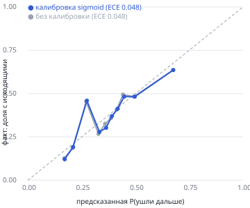

# Отчёт прогона

## Качество данных

- **n_nodes**: 2248
- **n_edges**: 3119
- **n_tx**: 4840
- **n_seed**: 81
- **turnover_kzt**: 365890012.01
- **period**: 2026-07-01 — 2026-07-31
- **depth_counts**: {0: 81, 1: 472, 2: 462, 3: 789, 4: 444}
- **edges_match_tx_pairs**: True
- **edges_match_tx_sums**: True
- **edges_match_tx_counts**: True
- **orphans**: 19
- **seed_not_in_edges**: 19
- **seed_only_receivers**: 12
- **seed_without_outgoing**: 31
- **depth4_zero_out**: 444
- **tx_below_5000**: 0
- **unknown_gids_in_edges**: 0

## Роли

- периферия (`peripheral`): 1715
- конечный получатель (`terminal`): 409
- распределитель (`distributor`): 56
- транзит (`transit`): 34
- консолидатор (`consolidator`): 30
- координатор (`coordinator`): 4

## Модель обрыва 4-го колена: калибровка и порог

Статус: **ok**. CV ROC-AUC 0.659 (порог отказа от прогноза 0.6); перенос 1–2 → 3 колено: 0.660. Обучено на 1723 узлах 1–3 колена, доля с исходящими 0.374.

Калибратор: **sigmoid** (isotonic только при снижении Brier ≥ 1%, иначе Platt (sigmoid)). Brier: без калибровки 0.2166, sigmoid 0.2166, isotonic 0.2153. ECE 0.0484 (без калибровки 0.0476).

| корзина | средний прогноз | факт (доля с исходящими) | узлов |
|---|---|---|---|
| 1 | 0.172 | 0.121 | 173 |
| 2 | 0.211 | 0.192 | 172 |
| 3 | 0.275 | 0.459 | 172 |
| 4 | 0.333 | 0.279 | 172 |
| 5 | 0.364 | 0.302 | 172 |
| 6 | 0.391 | 0.370 | 173 |
| 7 | 0.418 | 0.413 | 172 |
| 8 | 0.448 | 0.483 | 172 |
| 9 | 0.497 | 0.483 | 172 |
| 10 | 0.676 | 0.636 | 173 |

### Коэффициенты (стандартизованные признаки, 95% bootstrap-интервал, n=200)

| признак | коэф. | 95% ДИ | знак устойчив | значим |
|---|---|---|---|---|
| лог. входящий оборот (от более мелких колён) | +0.508 | [-0.058; +1.042] | 92% | нет |
| число плательщиков | +0.106 | [-0.030; +0.261] | 92% | нет |
| лог. число входящих переводов | -0.003 | [-0.332; +0.450] | 43% | нет |
| лог. средний входящий чек | -0.563 | [-1.067; -0.056] | 98% | да |
| дней с поступлениями | +0.247 | [-0.080; +0.580] | 96% | нет |
| дней до конца периода после последнего поступления | +0.049 | [-0.049; +0.154] | 80% | нет |
| среднее число получателей у плательщиков | -0.458 | [-0.575; -0.327] | 100% | да |
| макс. доля исходящих плательщика, пришедшая узлу | -0.062 | [-0.164; +0.058] | 84% | нет |

### Выбор порога terminal_max_p_continue

Правило: наибольший порог с precision_cv ≥ доля стоков + 0.1 = 0.7262. Рекомендовано правилом: **0.35**, в config: **0.35** (совпадает).

| порог | отобрано на CV | precision (CV) | recall (CV) | узлов 4-го колена | ожид. precision на 4-м |
|---|---|---|---|---|---|
| 0.15 | 9 | 0.889 | 0.007 | 0 | — |
| 0.20 | 243 | 0.893 | 0.201 | 0 | — |
| 0.25 | 346 | 0.841 | 0.270 | 0 | — |
| 0.30 | 514 | 0.745 | 0.355 | 1 | 0.714 |
| 0.35 | 678 | 0.742 | 0.466 | 35 | 0.668 |
| 0.40 | 1006 | 0.715 | 0.666 | 151 | 0.635 |
| 0.45 | 1307 | 0.683 | 0.828 | 284 | 0.607 |
| 0.50 | 1479 | 0.665 | 0.911 | 366 | 0.590 |
| 0.55 | 1548 | 0.655 | 0.940 | 389 | 0.583 |
| 0.60 | 1613 | 0.649 | 0.970 | 412 | 0.574 |

Ожидаемое число настоящих стоков среди 444 обрезанных: 245.

## Топ-10

| # | gid | роль | priority | почему |
|---|---|---|---|---|
| 1 | 100000003115284100 | coordinator | 0.922 | координатор (уверенность 0.85): По хронологии доходят деньги 7 seed, вход 2.2 млн; сводит 2 ветви, +2 seed сверх любой из них [≤2дн ушло 99%; 7 плательщ. в 1 де |
| 2 | 100000007908818100 | coordinator | 0.864 | координатор (уверенность 0.84): По хронологии доходят деньги 7 seed, вход 727 тыс.; сводит 3 ветви, +3 seed сверх любой из них Главные факторы приоритета: деньг |
| 3 | 100000006889963100 | coordinator | 0.851 | координатор (уверенность 0.85): По хронологии доходят деньги 7 seed, вход 1.4 млн; сводит 2 ветви, +2 seed сверх любой из них [≤2дн ушло 100%; 4 плательщ. в 1 д |
| 4 | 100000004015047100 | consolidator | 0.800 | консолидатор (уверенность 0.94): Получает от 9 плательщ. (3 seed) 919 тыс., 18 перев., ср. 51 тыс.; по хронологии доходят деньги 5 seed [в 1 циклах; нетипично д |
| 5 | 100000008165763100 | consolidator | 0.784 | консолидатор (уверенность 0.86): Получает от 15 плательщ. (1 seed) 1.2 млн, 26 перев., ср. 45 тыс.; по хронологии доходят деньги 2 seed [4 плательщ. в 1 день; н |
| 6 | 100000004156082100 | distributor | 0.715 | распределитель (уверенность 0.78): Рассылает 26 получателям 2.3 млн (веер 5:1), 29 перев., ср. 80 тыс.; отдал в 6× больше видимого входа [≤2дн ушло 96%; в 11 ци |
| 7 | 100000000343175100 | distributor | 0.713 | распределитель (уверенность 0.81): Рассылает 31 получателям 4.0 млн (веер 4:1), 33 перев., ср. 121 тыс.; отдал в 22× больше видимого входа (seed: вход занижен)  |
| 8 | 100000002939838100 | coordinator | 0.703 | координатор (уверенность 0.66): По хронологии доходят деньги 4 seed, вход 571 тыс.; сводит 2 ветви, +2 seed сверх любой из них Главные факторы приоритета: деньг |
| 9 | 100000002894076100 | terminal | 0.698 | конечный получатель (уверенность 0.99): Получил 1.1 млн от 4 плательщ. (6 перев., ср. 187 тыс.); внутрибанк. исходящих ≥5 тыс. нет на колене 1 [3 плательщ. в 1  |
| 10 | 100000002838861100 | consolidator | 0.682 | консолидатор (уверенность 0.67): Получает от 5 плательщ. (2 seed) 555 тыс., 5 перев., ср. 111 тыс.; по хронологии доходят деньги 2 seed [в 1 циклах] Главные фак |

## Кластеры (первые 10)

| id | узлов | seed | оборот внутри | устойчивость | гипотеза |
|---|---|---|---|---|---|
| 4 | 175 | 3 | 22,721,611 | 0.32 | Признаки управляющего звена: 3 seed, ключевой узел 100000003115284100 (координатор, №1 по приоритету в кластере); внутренний оборот 22.7 млн. Проверить как возможную вершину схемы. Кластер неустойчив (воспроизводимость 0.32) — границы условны |
| 15 | 54 | 0 | 8,837,055 | 0.95 | Узел концентрации потоков 100000007908818100 (координатор, №1 по приоритету в кластере) без seed внутри кластера; оборот 8.8 млн. Связь с seed только через внешние рёбра — сначала исключить легальный бизнес (KYC) |
| 12 | 66 | 3 | 7,625,974 | 0.69 | Признаки управляющего звена: 3 seed, ключевой узел 100000006889963100 (координатор, №1 по приоритету в кластере); внутренний оборот 7.6 млн. Проверить как возможную вершину схемы |
| 6 | 147 | 5 | 20,832,032 | 0.49 | Ячейка сбора: 5 seed → 4 консолидатор(а); 100000004015047100 (консолидатор, №1 по приоритету в кластере); оборот 20.8 млн. Кластер неустойчив (воспроизводимость 0.49) — границы условны |
| 8 | 142 | 3 | 19,525,103 | 0.66 | Ячейка сбора: 3 seed → 2 консолидатор(а); 100000008165763100 (консолидатор, №1 по приоритету в кластере); оборот 19.5 млн |
| 3 | 177 | 8 | 25,034,776 | 0.89 | Ячейка сбора: 8 seed → 1 консолидатор(а); 100000004156082100 (распределитель, №1 по приоритету в кластере); оборот 25.0 млн |
| 17 | 42 | 0 | 4,121,910 | 0.91 | Узел концентрации потоков 100000002939838100 (координатор, №1 по приоритету в кластере) без seed внутри кластера; оборот 4.1 млн. Связь с seed только через внешние рёбра — сначала исключить легальный бизнес (KYC) |
| 10 | 77 | 14 | 14,261,789 | 0.7 | Ячейка сбора: 14 seed → 1 консолидатор(а); 100000005382566100 (консолидатор, №1 по приоритету в кластере); оборот 14.3 млн |
| 14 | 54 | 0 | 16,858,436 | 0.73 | Распределительная ветка: 100000007442518100 (консолидатор, №1 по приоритету в кластере); 25 периферийных получателей — возможные дропы/выплаты |
| 13 | 61 | 2 | 24,045,352 | 0.6 | Ячейка сбора: 2 seed → 2 консолидатор(а); 100000003265158100 (транзит, №1 по приоритету в кластере); оборот 24.0 млн |

## Устойчивость: доля путей seed→узел после изъятия N узлов

| N | priority | pagerank | in_kzt | betweenness | out_deg | hub | random |
|---|---|---|---|---|---|---|---|
| 0 | 1.00 | 1.00 | 1.00 | 1.00 | 1.00 | 1.00 | 1.00 |
| 5 | 0.98 | 1.00 | 0.99 | 0.55 | 0.85 | 0.75 | 1.00 |
| 10 | 0.72 | 0.99 | 0.99 | 0.49 | 0.69 | 0.44 | 0.99 |
| 20 | 0.70 | 0.96 | 0.98 | 0.29 | 0.25 | 0.42 | 0.98 |
| 50 | 0.52 | 0.94 | 0.86 | 0.18 | 0.14 | 0.23 | 0.94 |

Время полного прогона: 13.56 с